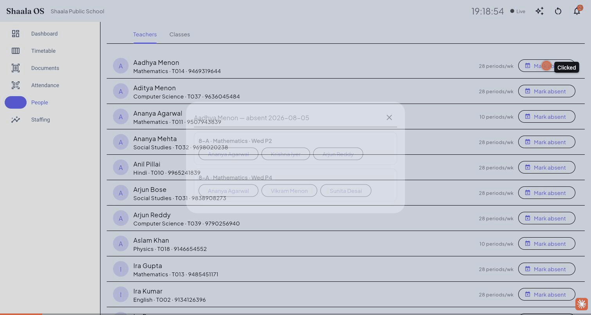
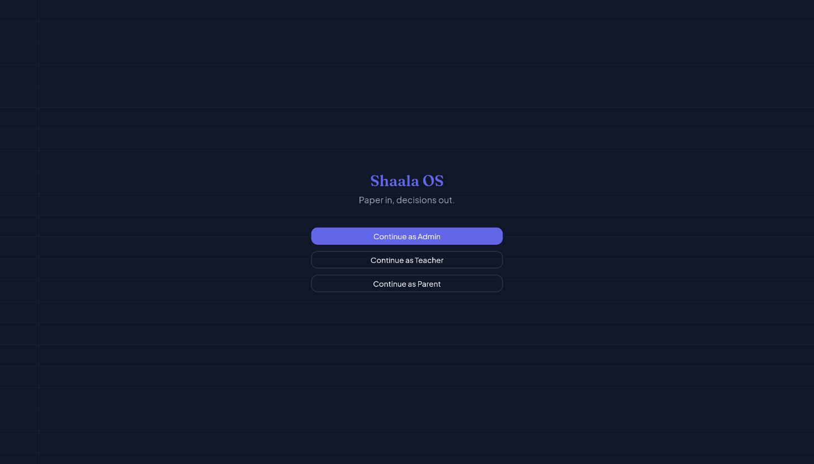
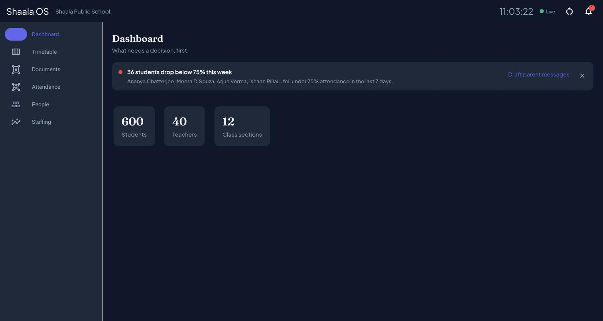
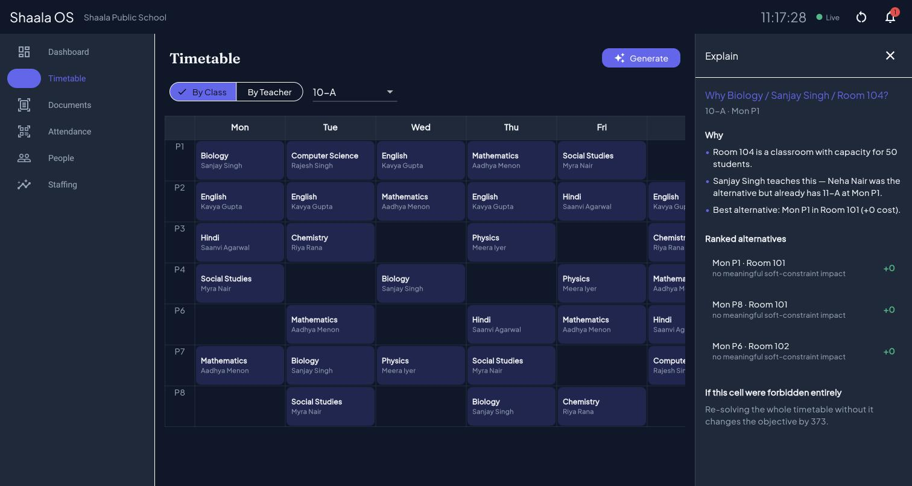
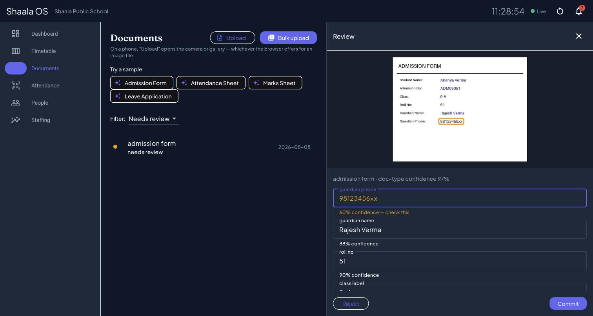
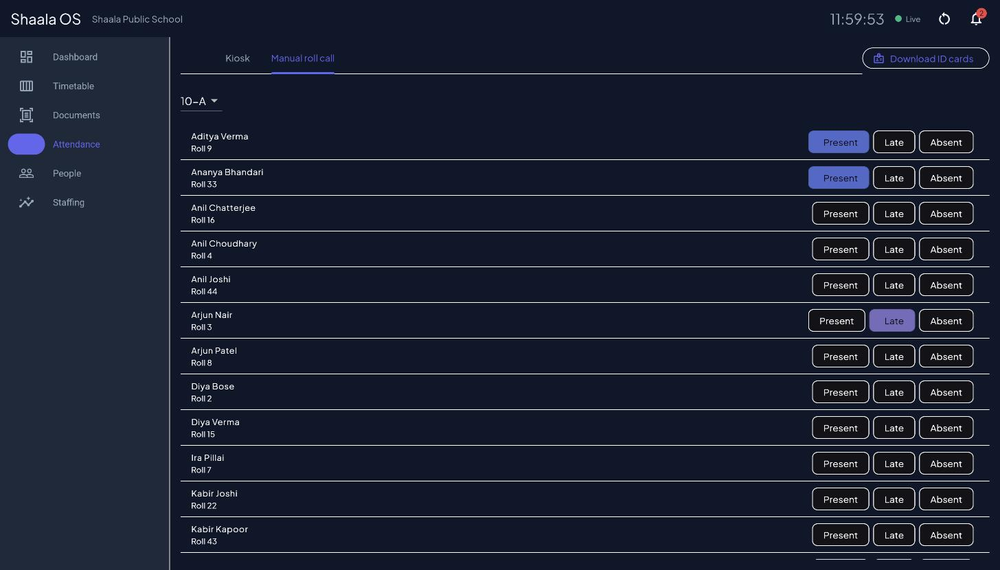
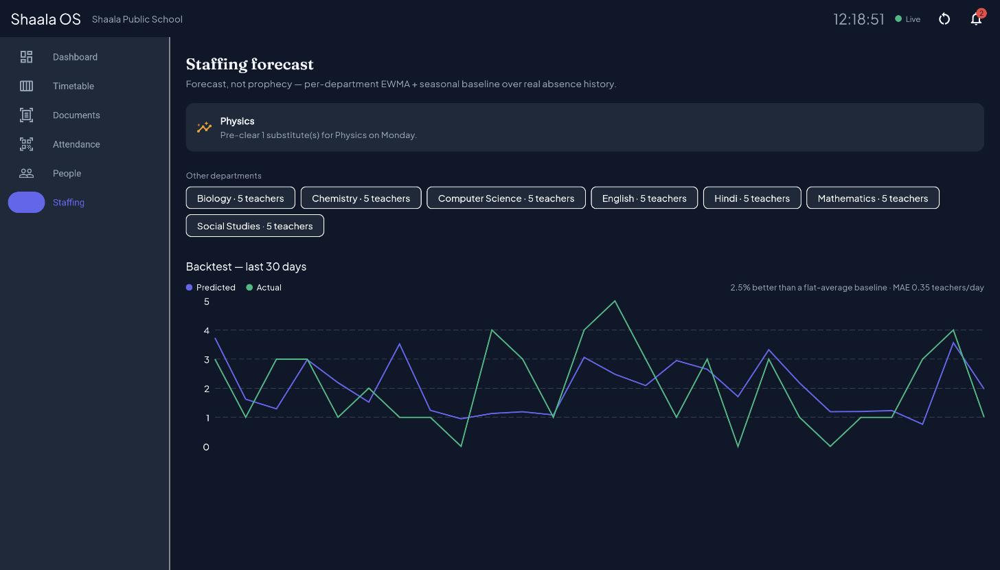
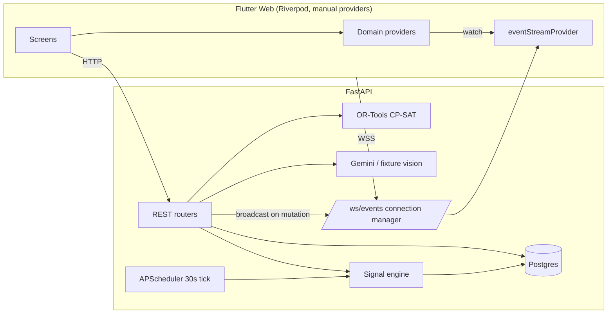

# Shaala OS

**Paper in, decisions out.**

Shaala OS turns a school's paper and chaos into a live database, then acts on it —
reading forms with AI, generating conflict-free timetables with a real constraint
solver, and telling the principal what needs attention before they think to ask.

Built for PaperBuddy EduHack ("Hack the Web"), track: Future-Ready Ops.

---

## Hero GIF



Mark a teacher absent → every uncovered period surfaces with ranked substitute
candidates → one tap each → the Outbox drafts the notification. No manual
lookup, no phone calls down a corridor.

---

## Live demo

> | | |
> |---|---|
> | Live app | **https://shaala-os.vercel.app** |
> | API | https://shaala-os-api.onrender.com (`/health`, `/ws/events`) |
> | Demo logins | Tap "Continue as Admin / Teacher / Parent" on the login screen — no password needed. (Direct: `POST /auth/demo-login?role=admin\|teacher\|parent`) |
> | Reset demo data | `POST /demo/reset`, or the reset icon in the app header. |
>
> Render's free tier sleeps after inactivity — the first request after a while may
> take a few seconds to wake up.

---

## The problem

Indian schools run on paper: admission forms, attendance registers, leave
applications, marks sheets. Timetables are built by hand and collapse the moment a
teacher calls in sick. Principals find out about problems (an uncovered class, a
student sliding toward the attendance cliff) only when someone complains — never
before. One number: a single teacher absence today means **45 minutes** of a clerk
running down corridors with a register. Shaala OS makes that **six seconds**.

---

## Features

Mapped to the problem statement's own headings so nothing is left to interpretation:

| Problem statement heading | What Shaala OS ships | Where |
|---|---|---|
| AI Document Reader | Upload → preprocess → Gemini extraction with per-field confidence → human-in-the-loop review UI → commit to real records | §6.1, `services/api/app/services/vision/`, `apps/admin/lib/features/documents/` |
| Smart Timetables | OR-Tools CP-SAT solver, explain-any-cell, drag-and-drop with live validation, one-tap substitute repair | §6.2, `services/api/app/services/timetable/`, `apps/admin/lib/features/timetable/`, `docs/solver.md` |
| All-in-One System | Single Postgres schema, one WebSocket event bus, every screen reacts live — no page is an island | §4, `services/api/app/ws/`, `apps/admin/lib/core/ws_client.dart` |
| Proactive Dashboard | Action Center: a prioritized inbox of one-tap decisions, not a wall of charts | §6.3, `services/api/app/services/signals/`, `apps/admin/lib/features/dashboard/` |
| Smart Staffing | Transparent EWMA + seasonal-baseline 7-day forecast with a real backtest, not a black box | §6.5, `services/api/app/services/staffing/`, `apps/admin/lib/features/staffing/` |
| Auto-Attendance | QR ID cards + kiosk scanning, optional fixture-backed group-photo mode, manual roll-call fallback | §6.4, `apps/admin/lib/features/attendance/` |

---

## Screenshots

| | |
|---|---|
|  **Login** — a ruled-paper texture and a serif wordmark, a deliberate nod to the paper this product exists to digitize. |  **Dashboard** — the Action Center: a prioritized inbox of one-tap decisions, not a wall of charts. |
|  **Timetable** — CP-SAT solver output with explain-any-cell: why this assignment, ranked alternatives, and the cost of forbidding it entirely. |  **Document review** — bbox overlay drawn from the field's real extracted coordinates, low-confidence fields sorted to the top. |
|  **Attendance** — manual roll call with live state per student; the kiosk tab does the same over a QR scan. |  **Staffing forecast** — EWMA + seasonal baseline, with a real backtest against a naive baseline, not a black-box number. |

---

## Architecture



One Postgres schema, one WebSocket bus, one CP-SAT solver — no separate
notification service, no polling, no second database for "real-time" state.

**Why CP-SAT, not a greedy scheduler.** Timetabling is a genuine constraint
satisfaction problem — one teacher can't be in two rooms, a lab subject needs a lab
room, weekly quotas must land exactly. A greedy or randomized heuristic can produce
a schedule that *looks* plausible and silently violates a hard constraint, or gets
stuck and can't explain why. CP-SAT gives us a real feasibility proof, a weighted
objective for the soft preferences (idle gaps, subject spread, workload balance),
and — critically — the ability to re-solve with one assignment forbidden and diff
the objective, which is what powers the "explain this cell" feature. See
`docs/solver.md` for the full model.

**Why a WebSocket-driven Riverpod architecture.** The brief asks for a dashboard
that updates seamlessly whenever data changes, on any connected device, without
polling. A single `/ws/events` connection feeds an `eventStreamProvider`; every
domain provider (`ActionItemsNotifier`, timetable, attendance) listens to it and
invalidates itself on the events it cares about. No `setState` for server data,
anywhere — `AsyncValue.when` end to end, with skeleton loading states instead of
spinners. This is also what makes the cross-device demo moment (scan a QR on a
phone, watch a laptop counter move) fall out of the architecture for free instead
of needing to be special-cased.

---

## Run locally

```bash
git clone https://github.com/arunishrajput/shaala-os.git
cd shaala-os
cp .env.example .env        # fill in secrets; VISION_PROVIDER=fixture needs none
make demo                   # Postgres + API in Docker, migrated, and seeded
```

Then `cd apps/admin && flutter run -d chrome`, or open the deployed web URL above.
`make verify` runs the full gate (lint, types, tests, Flutter analyze + web build)
locally before every commit.

---

## What's real vs. what's stubbed

Judges find the stubs anyway — naming them first is a credibility signal, not a
weakness. Updated at the end of every phase.

| Area | Status |
|---|---|
| Foundation — data model, fixed-seed data, JWT + 3 demo logins, deploy | ✅ Phase 1 done |
| Flutter shell — theme, nav rail, WS-driven Riverpod, People (read-only) | ✅ Phase 1 done |
| Timetable solver — CP-SAT, explain-any-cell, drag-and-drop validation | ✅ works locally (~8s, verified); ⚠️ **"Generate" doesn't complete on the live deployed URL** — Render's free-tier RAM can't fit the solve, root-caused (see PROGRESS.md), fix deferred to Phase 5/6 |
| Substitute repair algorithm | ✅ Phase 4: wired end to end (`POST /timetable/absence` + `/substitute`), verified live — marked a teacher absent, saw the real uncovered periods, assigned all of them, watched the Action Center card clear itself |
| AI document reader — upload/bulk/"Try a sample", extract, review UI with bbox + confidence, commit to real rows | ✅ Phase 3 done, verified live on the deployed URL (fixture provider tested end to end; Gemini provider built + verified against current API docs, not yet exercised live — no key in this session) |
| Proactive Action Center — 6 real signal rules, one-tap resolve/dismiss, live bell badge | ✅ Phase 4 done, verified live |
| Notification Outbox — real drafted messages, never sent | ✅ Phase 4 done, verified live |
| QR attendance kiosk + ID cards + manual roll call | ✅ Phase 4 done, verified live (including the cross-device moment: a scan from a second client updated a still-open browser tab's counter with no local action) |
| Staffing forecast + backtest chart | ✅ Phase 4 done, verified live in Phase 6 (see screenshot above — real `fl_chart` backtest, predicted-vs-actual, honest skill score against a flat-average baseline) |
| `POST /demo/reset` + header button | ✅ Phase 4 done, verified live in Phase 5/6 — confirm → progress → full reload → back to login, timed at 5.8–6.7s against production (budget is 15s) |
| Feature freeze & bug bash (Phase 5) | ✅ done — swept every screen for raw exception strings (routed through one `friendlyError()` helper), dead ends (an error state that hid otherwise-actionable UI), missing empty states, and mobile-responsive breakpoints. Found and fixed two real production bugs this pass surfaced: a raw Dio exception leaking to the UI on a Render cold start, and a missing `Cache-Control: no-store` header that let the browser serve a stale cached response for the dashboard's live student counter after a commit — both root-caused with direct evidence (not guessed) and live-reverified. Two screens (mobile-width breakpoints) are code-reviewed and statically verified but not yet live-clicked due to browser tooling instability late in the session |
| Group-photo attendance | ⏳ Optional stretch — didn't build it this session (Phase 4 had enough scope); returns a clear 501, not a silent failure |
| Principal's Weekly Briefing / Ask Shaala (⌘K) | ⏳ Phase 5 stretch only — not built; Phase 5 went to feature freeze and bug fixing instead per PROMPT.md's own hard rule (a flawless five-feature product beats a shaky eight) |

---

## Roadmap — and what we deliberately did not build

**Out of scope, on purpose:** fee management, LMS/course content, exam paper
generation, report cards, payment gateways, multi-tenancy, i18n, settings pages,
dark-mode toggles, RFID/IoT/firmware. These are PaperBuddy's own shipping features —
building them would show no insight and invite a losing comparison to the judge's
own product. This is deliberately an **ops-intelligence layer**, not another ERP.

The moat we chose to build instead: a real constraint solver for timetabling, a
document pipeline with genuine human-in-the-loop review, and a dashboard that tells
the principal what to do next instead of a wall of charts.
